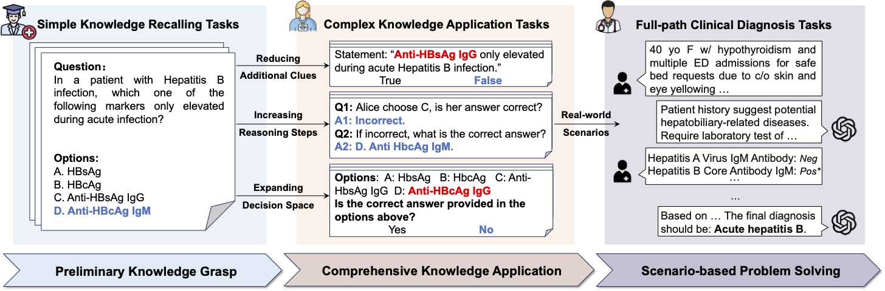

# MultiCogEval
Code and datasets of the **ICML 2025** paper: 

**Evaluating LLMs Across Multi-Cognitive Levels: From Medical Knowledge Mastery to Scenario-Based Problem Solving**

📄[Read the paper](https://openreview.net/pdf?id=sgrJs7dbWC)
## 🚀Introduction
**MultiCogEval** (short for **Multi**-**Cog**nitive-Level Medical **Eval**uation Framework) is a medical benchmarking suite designed to evaluate the capabilities of large language models (LLMs) from a cognitive development perspective.

🧬 Inspired by how clinicians are trained, MultiCogEval spans three progressive cognitive levels:\
	1.	📘 Preliminary Knowledge Grasp \
	2.	🧩 Comprehensive Knowledge Application \
	3.	🩺 Scenario-Based Clinical Problem Solving

We leverage three widely-used medical datasets—MedQA, MedMCQA, and MIMIC-IV—to construct evaluation tasks aligned with these cognitive stages.

## Requirement
>torch==2.1.2 \
transformers==4.39.2 \
vllm==0.4.0 \
pandas==1.5.3 \
scipy==1.10.1 \
en-core-sci-lg \
scikit-learn \
tqdm

## Evaluation
### Low-Level and Mid-Level
The original datasets and the generated mid-level questions are provided in `data/medqa` and `data/medmcqa`. Simply run the following command for evaluation:
> python scripts/evaluate_low_mid_levels.py --model [MODEL_PATH] --model_name [MODEL_NAME] --num_cuda [NUMBER_OF_GPUS] --typs MCQ SV AE MR
### High-Level
We generate the high-level evaluation samples by adapting the data creation process in [MIMIC-CDM](https://github.com/paulhager/MIMIC-Clinical-Decision-Making-Dataset). 

Due to the MIMIC-IV agreement, we cannot directly provide the generated evaluation samples. Instead, please first download MIMIC-IV [here](https://physionet.org/content/mimiciv/2.2/) and place the original dataset in `data/mimic-iv/origin`.

Then, run the data generation script:
> python gen_high_level.py

Finally, run the following script for evaluation:
> python scripts/evaluate_high_level.py --model [MODEL_PATH] --model_name [MODEL_NAME] --num_cuda [NUMBER_OF_GPUS] --seed [SEED]
## Metrics Calculation
Run `scripts/evaluate.ipynb` to calculate the performance metrics for tasks of different cognitive levels.
## Citation
TBD
## Acknowledgement
We would like to thank the authors of `MedQA`, `MedMCQA`, `MIMIC-IV` and `MIMIC-IV-CDM` for their great work.